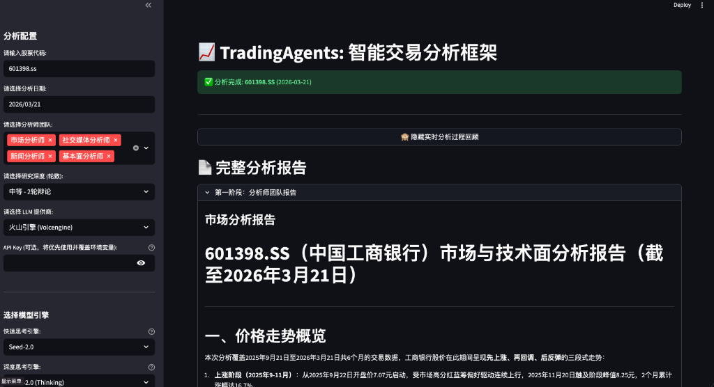
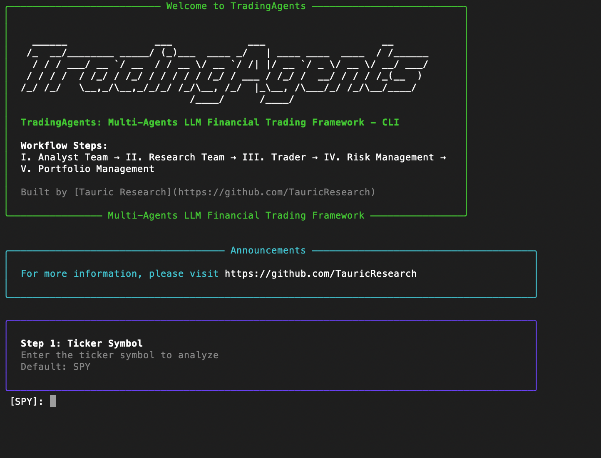

<p align="center">
  
</p>

# 📈 TradingAgents (WebUI版)

本项目是基于 [TauricResearch/TradingAgents](https://github.com/TauricResearch/TradingAgents) 衍生并进行深度重构优化的增强版本。原项目构筑了优秀的 AI 交易员多智能体框架，本项目在此基础上进行了大量底层架构修复和本土化模型扩展。

## 🌟 核心增强特性 (New Features by SpaceRexxx)
- **原生并行化与沙盒引擎**：彻底修复原版多智能体并行运行时的 `INVALID_CONCURRENT_GRAPH_UPDATE` 内存污染与图谱幻觉冲突，四位分析师真正实现 100% 稳定的并发拉取与推演。
- **全方位大模型支持**：无缝接入 NVIDIA DeepSeek V3、火山引擎 (Volcengine/Ark)、OpenAI 等本土常用优质前沿模型。
- **动态 Web UI 面板**：支持通过侧边栏直观地注入不同供应商的 API Key，彻底接管系统环境变量。且**分析结尾新增可视化报告渲染与一键导出 PDF 机制**。
- **底层架构极限重构**：
  - 屏蔽 HTTP/2 降级干扰解决 `openai.APIConnectionError` 报错。
  - 重构 `memory.py` 消除全局变量状态逃逸。
  - 弃用前沿语法，改用原生 `SystemMessage` 对象注入，完美向下兼容旧版本 `langgraph` (解决 `state_modifier` kwargs 报错)。
  - 强化数据流：增加并修复了 `obv` (能量潮) 等关键指标的数据别名映射。

---

## 更新日志 (News)
- [2026-03] **TradingAgents SpaceRexxx Fork** 现已深度整合**无缝原生并行执行引擎**以及**火山引擎 (Volcengine) / NVIDIA DeepSeekV3 / OpenAI API** 支持！
- [2026-03] 上游原版 **TradingAgents v0.2.1** 发布，已覆盖 GPT-5.4、Gemini 3.1 和 Claude 4.6 模型。

<div align="center">

🚀 [系统架构](#tradingagents-系统架构) | ⚡ [安装与 Web UI 使用](#安装指南-installation) | 🎬 [演示视频](https://www.youtube.com/watch?v=90gr5lwjIho) | 🤝 [贡献指南](#参与贡献) | 📄 [引用](#引用)

</div>

## TradingAgents 系统架构

TradingAgents 是一个完全模拟现实世界顶级量化交易公司运作动态的多智能体（Multi-Agent）框架。通过部署由大语言模型（LLM）驱动的各种专业化智能体（从基本面分析师、情绪专家、技术分析师，到交易员、风险管理团队），平台可以协同评估复杂的市场状况并做出专业的交易决策。更重要的是，这些智能体会在系统内进行动态辩论（Debates），以共同寻找最优的交易策略。

<p align="center">
  
</p>

> TradingAgents 框架专为学术研究与实验而设计。实际的交易表现可能会因为多种因素而有很大差异，包括您选择的底层大语言模型能力、模型温度设定、交易周期、数据质量以及其他非确定性因素。[本框架不作为任何财务、投资或交易建议。](https://tauric.ai/disclaimer/)

我们的框架将复杂的交易任务分解为多个专业化的角色。这种分治策略确保了系统在面对庞杂的市场分析和决策时，依然能够保持强大和可扩展性。

### 分析师团队 (Analyst Team)
- **基本面分析师**：评估公司的财务报表和关键业绩指标，识别公司的内在价值与潜在危险信号。
- **社交情绪分析师**：利用情感打分算法分析社交媒体与公众情绪，感知短期的市场氛围。
- **新闻分析师**：密切跟踪全球新闻和宏观经济指标，解读大事件对市场现状的潜在影响。
- **技术分析师**：运用各类技术指标（如 MACD、RSI、OBV 等）检测交易走势，预测价格动向。

<p align="center">
  
</p>

### 研究员团队 (Researcher Team)
- 由“多头（看涨）”和“空头（看跌）”两位研究员组成，他们会对分析师团队提供的报告进行极其挑剔的审视。通过结构化的激烈辩论，他们将在潜在收益与固有风险之间进行权衡。

<p align="center">
  
</p>

### 交易员 (Trader Agent)
- 汇总分析师和研究员的全部报告与辩论记录，生成明智的交易计划提案。交易员负责确定交易的切入点、止损点、持仓规模等战略部署。

<p align="center">
  
</p>

### 风险管理团队与投资组合经理 (Risk Management & Portfolio Manager)
- 风险管理团队（通常由激进型、保守型、中立型风控制定者组成）持续评估投资组合层面的风险，审查交易团队提交的策略，并将包含风险预警的最终评估报告上交。
- **投资组合经理（Portfolio Manager）** 作为最后一道防线，负责批准或驳回交易员提出的交易提案。如果提案获批，指令将被发送至模拟交易所被正式执行。

<p align="center">
  
</p>

## 安装指南 (Installation)

本项目强依赖 Python 3.10 及以上环境，并由于集成了全新的 PDF 导出功能，您还需要安装 Playwright 浏览器内核。

### 🍎 macOS (Apple Silicon M1/M2/M3/M4/M5 或 Intel)
1. **安装环境管理工具 (Miniconda / Anaconda)**（如已安装可跳过）:
   ```bash
   brew install --cask miniconda
   ```
2. **下载并进入项目**:
   ```bash
   git clone https://github.com/SpaceRexxx/TradingAgents-WebUI.git
   cd TradingAgents-WebUI
   ```
3. **创建虚拟环境并激活**:
   ```bash
   conda create -n tradingagents python=3.11 -y
   conda activate tradingagents
   ```
4. **安装 Python 依赖库与浏览器内核**:
   ```bash
   pip install -r requirements.txt
   playwright install chromium
   ```

### 🪟 Windows (推荐使用 PowerShell/CMD)
1. **安装 Anaconda 或 Miniconda**:
   请前往 [Miniconda 官网](https://docs.conda.io/en/latest/miniconda.html) 下载 Windows 安装包并安装。
2. **在终端中下载并进入项目**:
   ```powershell
   git clone https://github.com/SpaceRexxx/TradingAgents-WebUI.git
   cd TradingAgents-WebUI
   ```
3. **创建虚拟环境并激活**:
   ```powershell
   conda create -n tradingagents python=3.11 -y
   conda activate tradingagents
   ```
4. **安装依赖与浏览器内核**:
   ```powershell
   pip install -r requirements.txt
   playwright install chromium
   ```

### 🐧 Linux (Ubuntu / Debian)
```bash
# 1. 下载项目
git clone https://github.com/SpaceRexxx/TradingAgents-WebUI.git
cd TradingAgents

# 2. 安装 Python3.11 及 venv (若不使用 conda)
sudo apt update
sudo apt install python3.11 python3.11-venv python3-pip -y
python3.11 -m venv venv
source venv/bin/activate

# 3. 安装依赖文件与对应的浏览器内核所需的系统包
pip install -r requirements.txt
playwright install chromium
playwright install-deps

# ⚠️ 部署小提示 (Linux 专用)
# 如果您在无界面的 Linux 服务器上发现导出的 PDF 中文显示为方块，请安装中文字体：
# sudo apt install fonts-noto-cjk -y
```

### 🛠️ 常见安装问题 (Troubleshooting)

如果您在安装过程中遇到以下报错，请参考对应解决方法：

#### 1. Conda 协议未接受 (CondaToSNonInteractiveError)
**报错现象**：提示 `Terms of Service have not been accepted`。
**解决方法**：在终端运行以下两条命令以接受服务条款：
```bash
conda tos accept --override-channels --channel https://repo.anaconda.com/pkgs/main
conda tos accept --override-channels --channel https://repo.anaconda.com/pkgs/r
```

#### 2. 环境激活报错 (CondaError: Run 'conda init')
**报错现象**：运行 `conda activate` 时提示需要先运行 `conda init`。
**解决方法**：
1. 运行初始化命令：`conda init zsh` (MacOS/Linux) 或 `conda init powershell` (Windows)。
2. **务必关闭当前的终端窗口，重新打开一个新的窗口**后再尝试运行 `conda activate tradingagents`。
3. 如果依然失败，可以尝试在当前窗口运行：`source ~/.zshrc` (MacOS) 以强制刷新配置。

#### 3. 分析成功但 PDF 未生成 / 找不到 Executable
**报错现象**：页面顶部显示“✅ 分析完成”，但**没有出现下载按钮**。如果您滚动到页面最底部，可能会看到发红的报错信息提示：`Executable doesn't exist at /.../headless_shell`。
**原因与解决方法**：这是因为由于您所处的运行环境只有 Python 包，却没有下载实际的**浏览器内核可执行文件**。
请务必在您的目标虚拟环境中（确保已经执行过 `conda activate tradingagents`），单独跑一次这个系统级写入命令：
```bash
playwright install chromium
```
*提示：如果您的环境存在别名或路径隔离，也可以尝试指定绝对路径，例如：`/您的conda环境路径/bin/playwright install chromium`。*

### 🔄 如何更新 (How to Update)
如果您已经安装过旧版本，请运行以下命令一键更新到最新版 (v1.7.0)：
```bash
git fetch --all
git reset --hard origin/main  # 注意：这会丢弃您本地对代码的修改
conda activate tradingagents
pip install -r requirements.txt
playwright install chromium
```

### 必需的 API (Required APIs)

本深度优化版本（SpaceRexxx 版）通过 Web UI 可以直接在前端注入 API Key（会自动留存浏览器缓存），但您依然可以选择通过配置 `.env` 文件或全局变量来让后端自动读取默认的 API Key：

```bash
export OPENAI_API_KEY=...          # OpenAI (GPT系列)
export DEEPSEEK_API_KEY=...        # DeepSeek
export NVIDIA_API_KEY=...          # NVIDIA NIM (DeepSeek V3等，格式通常为 nvapi- 开头)
export ARK_API_KEY=...             # 火山引擎 (Volcengine)
export ALPHA_VANTAGE_API_KEY=...   # Alpha Vantage 数据源
```

> [!IMPORTANT]
> **WebUI 秘钥持久化 (v1.6.1 新特性)**：
> 现在您可以在 WebUI 侧边栏直接输入 Key 并点击 **“保存到 .env”**。
    - **本地环境**：强烈推荐，可避免重复输入。
    - **公网/云端环境**：**请勿点击保存**，否则您的 Key 将会被持久化记录在服务器磁盘上，存在泄露风险。

> **💡 模型填写小贴士**：
> 如果您在使用**火山引擎 (Volcengine)**，在左侧边栏填写模型名称时，必须填写您在火山引擎控制台创建的 **Endpoint ID** (比如 `ep-2026xxxx-xxxx`)，而不是单纯的 "DeepSeek-V3"。

推荐的方法是：将源码目录中的 `.env.example` 复制一份并重命名为 `.env`，然后在其中填入您的密钥：
```bash
cp .env.example .env
```


## 🚀 运行项目 (Running the Project)

在运行前，请确保您已经完成了虚拟环境的激活 (`conda activate tradingagents`)。

本优化版支持两种互补的运行方式：

### 1. 启动 Web UI 可视化控制台 (推荐)
这是最直观的使用方式，支持侧边栏配置 API Key、实时追踪各智能体状态以及一键导出 PDF 研报：
```bash
streamlit run webapp.py
```

### 2. 启动极速 CLI 文本端 (黑客风格)
如果您倾向于在纯终端环境下工作，CLI 版本提供了完全并行的分析引擎和精美的 Rich 控制台渲染：
```bash
python -m cli.main
```

<p align="center">
  
</p>

> 🎉 **惊喜体验**：当整套多智能体多轮博弈结束后，Web 页面将会自动调起我们集成的 `Playwright` 引擎，将极长的 markdown 报表全自动转录渲染为优美的 **PDF 研报**。渲染完成后，您可以直接在左下角点击按钮下载！

### 高级功能：极速 CLI 控制台 (Optimized CLI)

如果您更倾向于在命令行中进行沉浸式交易分析，本项目提供了与 WebUI 功能**完全对等**的优化版 CLI。其不仅能在终端实时渲染出精美的控制台界面，更在效率上达到了极致：

**运行命令：**
```bash
python -m cli.main
```

**CLI 核心优化特性：**
- **⚡ 并发分析启动**：不同于常规 CLI 的串行排队，优化版 CLI 会同步唤起所有选中的分析师团队，实现真正并行的实时进度追踪。
- **🛰️ 供应商全兼容**：深度适配火山引擎、NVIDIA、DeepSeek、OpenAI 等全部主流供应商。
- **🔐 动态 Key 注入**：无需手动修改 `.env`，程序启动时会智能检测 Key 状态并支持交互式快速填入与清洗。
- **📄 自动化 PDF 生成**：CLI 分析一经结束，系统会立即在后台通过 Playwright 完成 PDF 渲染，并保存至 `results/` 目录下。

<p align="center">
  
</p>

---

## ⚖️ License & Acknowledgements (版权与致谢)

本项目的原始框架灵感与基础架构均来源于出色的开源研究工作 [TauricResearch/TradingAgents](https://github.com/TauricResearch/TradingAgents)，向原作者致以最诚挚的感谢。

本项目沿用原始的 [Apache License 2.0](./LICENSE) 协议进行开源分发。
- Original Work: Copyright 2024-2025 TauricResearch
- Modifications: Copyright 2026 SpaceRexxx

## 参与贡献

我们非常欢迎来自社区的各类贡献！不论是修复 Bug、改进说明文档、还是提议一项酷炫的新功能开发，您的积极参与都将让本框架变得愈发强大。

## 引用

如果 *TradingAgents* 的框架理念为您的量化研究或者学术开发带来了帮助，请引用原作者的论文：

```
@misc{xiao2025tradingagentsmultiagentsllmfinancial,
      title={TradingAgents: Multi-Agents LLM Financial Trading Framework}, 
      author={Yijia Xiao and Edward Sun and Di Luo and Wei Wang},
      year={2025},
      eprint={2412.20138},
      archivePrefix={arXiv},
      primaryClass={q-fin.TR},
      url={https://arxiv.org/abs/2412.20138}, 
}
```
